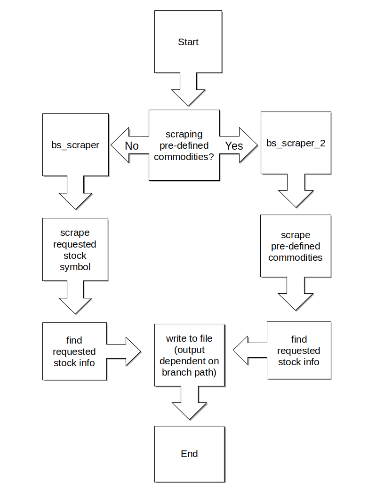

# yahoo-stock-scraper

Scrapes Yahoo for specified stock and outputs to pre-determined output folder and file name.  Relies on the following external python packages:

```requests```
and
```beautifulsoup4```

## Usage

By default, if run multiple times during a day, it will concatenate into one file per day. Using one of two flags will alter output.

**```-m```**
will concatenate data into one large file, using the stock name identifier (see examples below).

**```-mo```**
will concatenate data into one monthly file, using the stock name identifier (see examples below). Take note that this will supercede the large file option.

**```-v```**
shows versioning info.  This does not require any other info and will ignore all other flags.

### Commodities scraping

**```-c```**
will scrape data from a CSV file in the ```csv_config_files``` folder, with the following flags to determine what will be scraped. You will still need to supply a stock name and stock id, but that stock will be ignored with this flag.

    -i      Scrape market indexes
    -f      Scrape fuel futures
    -p      Scrape precious metal futures
    -o      Scrape user supplied list of commodities

### **Code execution as follows:**

    python3 yahoo-stock-scrapyer.py {flag} [Yahoo's URL identifier] [Stock identifier] 
Or make the file excutable and leave off the python3 command

### **Examples:**

Executing

    python3 yahoo-stock-scrapyer.py %E5DJI DJI
Will yield the output filename:
```DJI_YYYY-MM-DD.csv```

Executing

    python3 yahoo-stock-scrapyer.py GC%3DF Gold

Will yield the output filename:
```Gold_YYYY-MM-DD.csv```

* Time will be noted with recorded data:

    ```HH:MM:SS: 0.00```

#### **Using the -m or -mo flag:**

Executing

    python3 yahoo-stock-scrapyer.py -m GC%3DF Gold

Will yield the output filename:
```Gold.csv```

* Date and time will be noted with recorded data:

    ```YYYY-MM-DD_HH:MM:SS:  0.00```

Note that using ```-mo``` will create a file name: ```Gold-Mmm.csv```

## Output info

Output folder is hard-coded as
```data```

The default base folder path is hard coded in ```scrape.py``` and is currently:

```/{Path to User Home Directory}/Documents/Code/yahoo-stock-scraper/```
or
```C:\\Users\\{USER}\\Documents\\Code\\yahoo-stock-scraper```

The resulting output directory path is:

```/{Path to User Home Directory}/Documents/Code/yahoo-stock-scraper/data```
or
```C:\\Users\\{USER}\\Documents\\Code\\yahoo-stock-scraper\\data```

### Error logging

Added in version ```0.4.3```, if errors in scraping data are encounted, the raw data will be recorded in the data folder under the year and month it was run and the file will be named as the date it occurred. Time of occurance will be recorded with the raw data. A prefix can be used, which is located at the top of ```scrape.py```.

### **Creating a cron job to automate scraper**

cron job setting for checking daily (M-F) at 9:00, 9:30, 12:00, 12:30, 16:00, 16:30:

     0,30 9,12,16 * * 1-5 /usr/bin/python3 /home/$USER/{folder path}/yahoo-stock-scraper/yahoo-stock-scraper.py GC%3DF Gold 

**For testing purposes only, DO NOT ABUSE Yahoo's TOS!**

## Code flow path

[<center> </center>](./images/bs_scraper_flow.png)

## Issues compiling due to importing BeautifulSoup

Issues compiling due to missing bs4 import

For Linux:
``` apt install python3-bs4 ```

For Windows:
```pip install beautifulsoup4```

## To Do

* ~~Add option to merge into one file~~ (completed)
* ~~Refactor into modular format~~ (completed)
* ~~Work out windows folder output path~~ (completed)
* ~~Create a second scraper for commodities that only makes one web request~~ (completed)
* ~~Take commodities data and output it to individual files for each commodity~~ (completed)
* ~~Add flag for commodities scraping~~ (completed)
* ~~Folder management needs testing for creating non-existent folders~~ (completed)
* Play audio to alert on error which could possibly be very intrusive
* Add guards against -i,-o,-f,-p flags when not using -c flag
* Add plotting feature. Or create a new project for it
